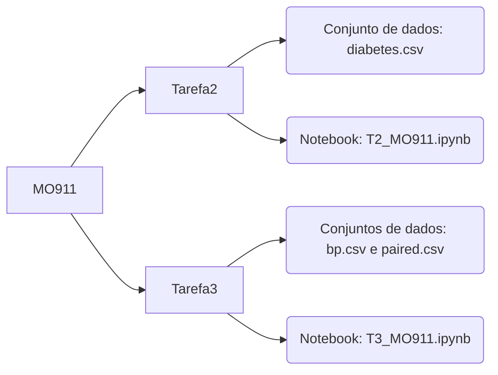

# MO911 - Introdução às Metodologias para Elaboração de Projeto de Pesquisa - 2S/2022

Repositório criado para disciplina MO911 - 2s2022, para submissão das atividades:
* **Tarefa 2** - Visualização de Dados
* **Tarefa 3** - Testes Estatísticos

Este repositório está organizado da seguinte forma: 

O diretório Tarefa2 contém o Notebook e o Conjunto de dados utilizados para a realização da Tarefa 2. 
O diretório Tarefa3 contém o Notebook e os conjuntos de dados utilizados para a realização da Tarefa 3. 

> Os notebooks presentes nesse diretório foram feitos utilizando a ferramente Google Colab e podem ser acessados via: 
> * Tarefa 2: https://colab.research.google.com/drive/1TkZBFf3NPD6YUrZVMerXok6VFuLOrLNW?usp=sharing
> * Tarefa 3: https://colab.research.google.com/drive/1orMCA09qBWkXmXg67g-aZCu9wnAnFSUl?usp=sharing
> 
> Porém, os notebooks também podem ser executados via Jupyter notebook.

# Descrição das Tarefas

## Tarefa 2
Escolha um ou mais datasets para gerar os 3 tipos de visualização de dados a seguir:
- um histograma
- um gráfico de barras ou pizza
- um gráfico de dispersão (scatter plot)

------
O conjunto de dados escolhido foi: "Diabetes Dataset - Diabetes Patients Data"
>> "This dataset is originally from the National Institute of Diabetes and Digestive and Kidney Diseases. The objective of the dataset is to diagnostically predict whether a patient has diabetes, based on certain diagnostic measurements included in the dataset. Several constraints were placed on the selection of these instances from a larger database. In particular, all patients here are females at least 21 years old of Pima Indian heritage. From the data set in the (.csv) File We can find several variables, some of them are independent (several medical predictor variables) and only one target dependent variable (Outcome)."

O conjunto de dados pode ser acessado, no Kaggle, através do seguinte link: https://www.kaggle.com/datasets/akshaydattatraykhare/diabetes-dataset

> O notebook presente no diretório Tarefa2 possui os 3 tipos de visualização de dados solicitados no conjunto de dados escolhido, assim como a resposta para a pergunta presente no formulário de entrega dessa tarefa.

## Tarefa 3
Crie um Jupyter notebook para rodar testes estatísticos nos dois datasets de exemplo (bp.csv e paired.csv). 

> O notebook presente no diretório Tarefa3 possui os testes estatísticos realizados em ambos conjuntos de dados, assim como as respostas para as perguntas presentes no formulário de entrega dessa tarefa.
